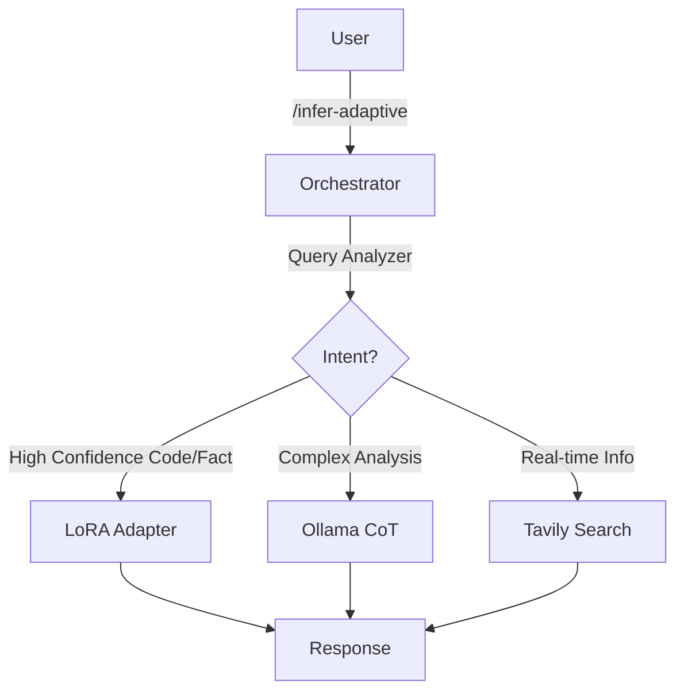

# FastAPI LLM Inference

LLM inference API with 4-bit quantization, LoRA fine-tuning, RAG, and intelligent routing.

## Features

**Quantization**: 4-bit inference using `bitsandbytes` (6x memory reduction, minimal accuracy loss)

**LoRA Fine-tuning**: Parameter-efficient fine-tuning on technical datasets with PEFT

**Agentic RAG**: Hybrid architecture using Rule Engine + LLM Judge to route queries between internal models (Fast) and external retrieval (Accurate).

**LoRA Fine-tuning**: Parameter-efficient fine-tuning on technical datasets with PEFT

**RAG**: Real-time information retrieval via Tavily API for accurate, current responses

**Metrics**: Prometheus monitoring for latency, request count, and classification precision/recall.

## Quick Start

```bash
# Install dependencies
pip install -r app/requirements.txt

# Configure environment
cp app/.env.example app/.env
# Edit app/.env: set API_KEY and TAVILY_API_KEY. Optional: OLLAMA_BASE_URL.

# Run server
python -m uvicorn app.main:app --reload

# Test Adaptive Endpoint (Agentic RAG)
curl -X POST http://localhost:8000/infer-adaptive \
  -H "Content-Type: application/json" \
  -d '{"prompt": "Explain the impact of quantum computing on cryptography"}'
```

## API Endpoints

| Endpoint | Description | Use Case |
|----------|-------------|----------|
| `GET /health` | Health check | Monitoring |
| `GET /metrics` | Prometheus Metrics | Observability |
| `POST /infer-adaptive` | **Agentic RAG Router** | **Production Entrypoint** (Routes to best strategy) |
| `POST /infer` | Base quantized model | Raw inference |
| `POST /infer-rag` | Tavily RAG | Forced external search |
| `POST /infer-lora` | LoRA Adapter | Forced adapter usage |

## Architecture



## Configuration

**Environment Variables** (`app/.env`):

- `API_KEY`: API authentication
- `USE_MOCK`: Use mock responses (CI/staging)
- `TAVILY_API_KEY`: Tavily RAG API key

## Tech Stack

- **Framework**: FastAPI 0.110+
- **LLM**: Qwen2.5-0.5B-Instruct (quantized)
- **Quantization**: bitsandbytes (4-bit NF4)
- **Fine-tuning**: PEFT (LoRA rank 16)
- **RAG**: Tavily API
- **Deployment**: Docker, GitHub Actions, Render

## CI/CD

Automated pipeline via GitHub Actions:
- Run tests on push
- Build Docker image
- Deploy to staging (auto)
- Deploy to production (on git tag)

See `.github/workflows/deploy.yml` for details.

## Performance

**Base Quantized Model**:
- Memory: ~2GB VRAM (4-bit quantization)
- Speed: ~1.5 tokens/sec (RTX 4050, CPU fallback supported)

**LoRA Adapter**:
- Training: 10-15 min (1000 samples, 1 epoch)
- Inference: Same as base (adapter overhead <5%)

**Smart Routing**:
- Cache hit rate: 33%+ (reduces Tavily costs)
- LoRA-first strategy: 70% queries answered without external API

## License

MIT
